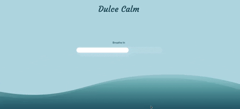

# 💻 Dulce Calm Web App (BETA)

Web app to help you slow down for a bit. Take a few deep breaths along with the animation. This project was bootstrapped with [Create React App](https://github.com/facebook/create-react-app).



## 🔨 Tools
- Node.js
- React
- React-DOM
- React-Create-App
- Npm
- CSS
- ES6


## ✨ Live Demo

You can look at it [here](https://intense-garden-00658.herokuapp.com/).


## 🚀 Getting Started


To get a local copy up and running follow these simple example steps.

### Clone

```sh
git clone git@github.com:misselliev/dulce-calm.git
cd dulce-calm
```

### Install

```sh
npm install
```

### Usage

```sh
npm start
```

### Requirements

- Latest version of **[NodeJS](https://nodejs.org/en/)** _-- (npm included)_.

## :pencil2: Todo
- Implement Dark Mode

## Author

👤 Elizabeth Villalejos

- [Github](https://github.com/misselliev)
- [Linkedin](https://linkedin.com/ellievillalejos)
- [Dev.to](https://dev.to/misselliev)
- [Twitter](https://twitter.com/miss_elliev/)
- [Instagram](https://www.instagram.com/miss_elliev/)
- [Email](mailto:elizabeth.villalejos@gmail.com?subject=Website%20Inquiry)


## 🤝 Contributing

Contributions, issues and feature requests are welcome!

Feel free to check the [issues page](issues/).

## Show your support

Give a ⭐️ if you like this project!

> “What simple action could you take today to produce a new momentum toward success in your life?” Tony Robbins
